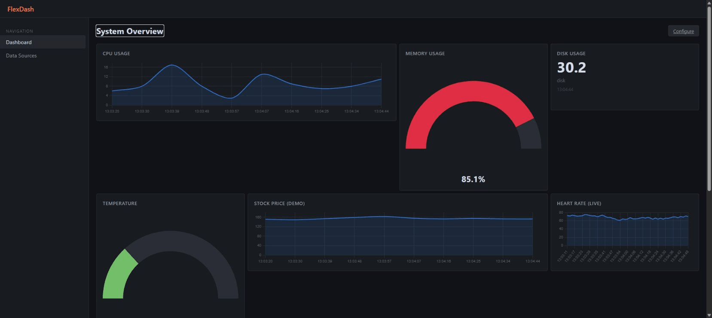
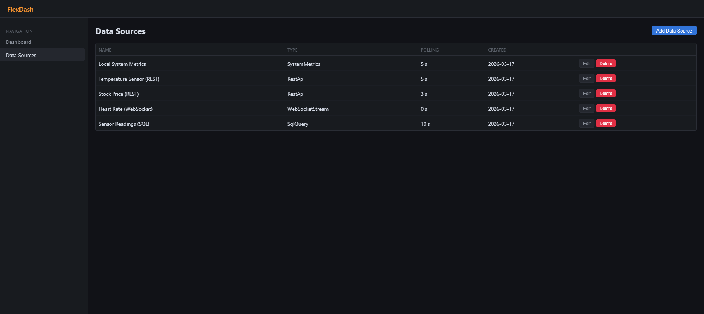
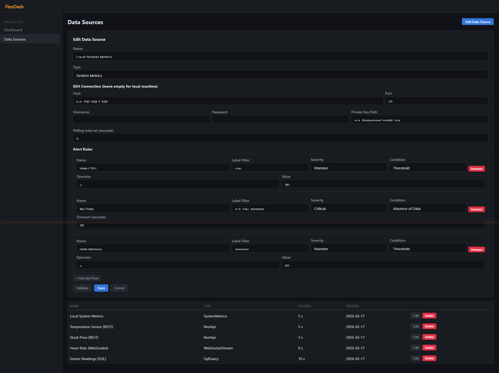
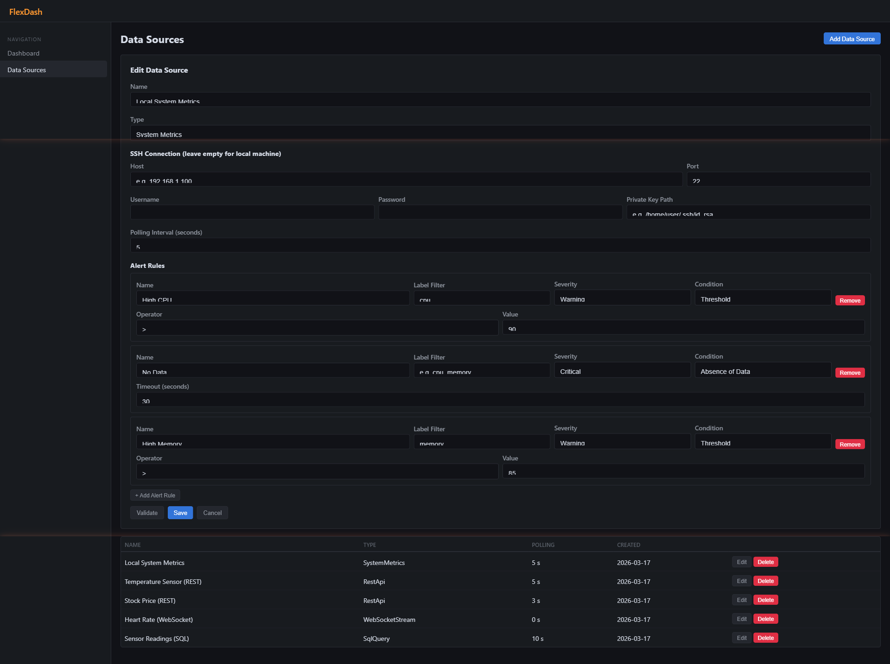

# FlexDash

## Why This Product?

Operations teams today juggle multiple monitoring tools — one for server health, another for API metrics, another for database queries, yet another for live data feeds. Each tool has its own dashboard, its own login, its own learning curve. When something breaks at 2 AM, you're switching between five browser tabs trying to correlate data.

**FlexDash solves this.** One dashboard. Multiple data sources. Real-time. You plug in your REST APIs, system metrics (local or remote via SSH), WebSocket streams — and FlexDash gives you a unified, configurable view with alerting built in. No vendor lock-in, no SaaS subscription, no data leaving your infrastructure.

Built with **ASP.NET Core 10** and **Blazor WebAssembly**. Designed to be purchased, deployed on-premise, and extended by your team.

## Screenshots

<table>
<tr>
<td width="50%"><strong>Dashboard — Real-Time Overview</strong><br></td>
<td width="50%"><strong>Data Sources Management</strong><br></td>
</tr>
<tr>
<td><strong>Edit Data Source + SSH Config</strong><br></td>
<td><strong>Built-In Alert Rules</strong><br></td>
</tr>
</table>

Each data source supports **multiple alert rules** defined right alongside the connection config — no separate alerting tool needed. The form adapts dynamically based on the condition type:

- **Threshold** — fires when a metric crosses a boundary (e.g. CPU > 90%). Supports `>`, `>=`, `<`, `<=`, `==` operators with label filtering.
- **Rate of Change** — detects sudden spikes or drops, catching anomalies that static thresholds miss.
- **Absence of Data** — triggers when a source stops reporting (e.g. no data for 30 seconds), so you know immediately if a server goes silent.

Set severity levels (Info / Warning / Critical) per rule, add as many rules as you need, and validate before saving. Alerts are evaluated in real-time by the built-in AlertEngine — zero external dependencies.

## Quick Start

```bash
# Prerequisites: .NET 10 SDK

# Start both API and Client
cd FlexDash.Api && dotnet run &
cd FlexDash.Client && dotnet run
```

- **Dashboard**: https://localhost:7123
- **API**: https://localhost:7095
- **OpenAPI Docs**: https://localhost:7095/scalar/v1

On first run, FlexDash seeds a local System Metrics dashboard with CPU, Memory, and Disk widgets.

## Features

- **3 Data Source Plugins**: REST API, System Metrics (local + remote via SSH), WebSocket Stream
- **4 Widget Types**: Line Chart, Gauge, Stat Card, Data Table
- **Real-Time Updates**: SignalR push with group-based subscriptions
- **Configurable Alerts**: Threshold, Rate of Change, Absence of Data — with label filtering
- **Remote Monitoring**: SSH-based metrics collection for Linux and Windows servers
- **Drag-and-Drop Layout**: Responsive grid with persistent positioning
- **Dark Theme**: Grafana-inspired dark UI

## Architecture

```
Blazor WASM ──[HTTP/SignalR]──> ASP.NET Core API ──> Plugin Layer ──> SQLite
                                    │
                              PollingWorker (5s)
                              AlertEngine
                              DataPointBuffer (RingBuffer)
```

See [docs/ARCHITECTURE.md](docs/ARCHITECTURE.md) for the full component diagram.

## Documentation

| Document | Description |
|----------|-------------|
| [Architecture](docs/ARCHITECTURE.md) | System architecture, component diagram, data flow |
| [Design Decisions](docs/DESIGN-DECISIONS.md) | Key design decisions with rationale and trade-offs |
| [User Guide](docs/USER-GUIDE.md) | How to run, configure, and use FlexDash |
| [AI Transparency](docs/ai-assistance/TRANSPARENCY.md) | AI tools used, what was generated vs human-authored |

## Key Design Highlights

- **Plugin Architecture** (Strategy Pattern) — extensible data source system
- **Ring Buffer** (Circular Queue) — bounded, O(1) in-memory data storage
- **Composite Design** — unified local/remote metrics via `ICommandRunner` abstraction
- **Template Method** — `MetricsCollectorBase` with OS-specific subclasses
- **Result Monad** — typed error handling without exceptions
- **Sealed by Default** — all classes sealed unless designed for inheritance

## Tests

```bash
dotnet test tests/FlexDash.Tests
```

**76 tests** | **100% passing** | **32.3% line coverage** | **24.5% branch coverage**

Coverage spans core utilities, all 4 plugins, alert engine (with label filtering), dashboard service, orchestrator, and platform-specific metrics collectors.

## Tech Stack

| Component | Technology |
|-----------|-----------|
| Backend | ASP.NET Core 10 |
| Frontend | Blazor WebAssembly |
| Database | SQLite + EF Core |
| Real-Time | SignalR |
| Charts | Chart.js 4.4.0 |
| SSH | SSH.NET 2024.2.0 |
| Logging | Serilog |
| Testing | xUnit + Coverlet |
